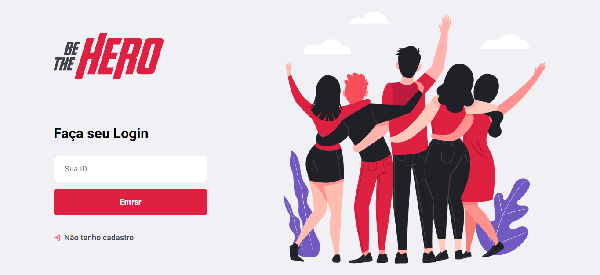
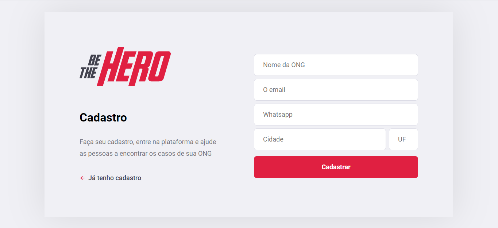

<h4 align="center"> 
	Semana OmniStack 11.0 em Desenvolvimento
</h4>

  
	
  

  

  

  

  <a href="#rocket-Tecnologias">Tecnologias</a>&nbsp;&nbsp;&nbsp;|&nbsp;&nbsp;&nbsp;
  <a href="#-project">Projeto</a>&nbsp;&nbsp;&nbsp;|&nbsp;&nbsp;&nbsp;
  <a href="#-layout">Layout</a>&nbsp;&nbsp;&nbsp;|&nbsp;&nbsp;&nbsp;
  <a href="#-como-contribuir">Como contribuir</a>&nbsp;&nbsp;&nbsp;|&nbsp;&nbsp;&nbsp;
  <a href="#memo-licensa">Licensa</a>

 

## :rocket: Tecnologias

Esse projeto foi desenvolvido com as seguintes tecnologias:

- [Node.js](https://nodejs.org/en/) 
- [React](https://reactjs.org)
- [SQLite](https://www.sqlite.org/)
- [React Native](https://facebook.github.io/react-native/) aguarde... :construction:
- [Expo](https://expo.io/) aguarde... :construction:

## 💻 Project

O Be The Hero é um projeto que visa conectar pessoas que estão dispostas a ajudar ONGs.

## 🔖 Layout

**Web**

 

 

**Mobile**

Aguardem... :construction:

## 🤔 Como contribuir

- Faça um fork desse repositório;
- Cria uma branch com a sua feature: `git checkout -b minha-feature`;
- Faça commit das suas alterações: `git commit -m 'feat: Minha nova feature'`;
- Faça push para a sua branch: `git push origin minha-feature`.

Depois que o merge da sua pull request for feito, você pode deletar a sua branch.

## :memo: Licensa

Este projeto está sob a licensa MIT. Veja o [LICENSE](LICENSE.md) para mais detalhes.

---

Desenvolvido por Igor Gabriel :wave: [Entrar em contato!](https://www.linkedin.com/in/igorgabrielg/)
